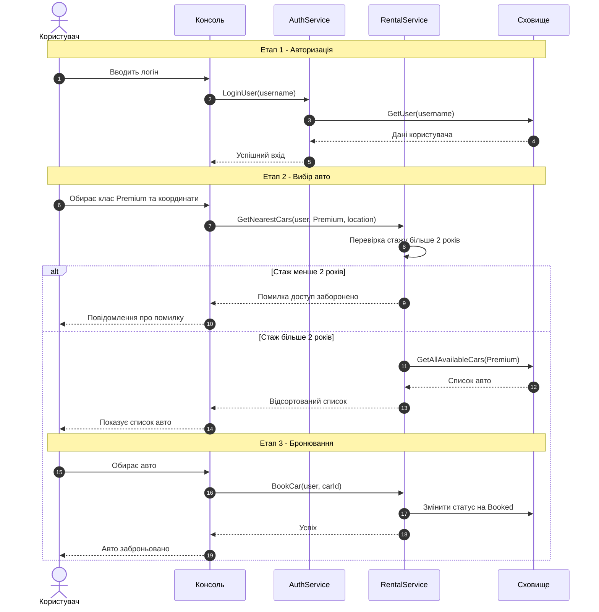

```mermaid
sequenceDiagram
    autonumber
    actor User as Користувач
    participant UI as Консоль
    participant Auth as AuthService
    participant Rental as RentalService
    participant DB as Сховище

    Note over User,DB: Етап 1 - Авторизація
    User->>UI: Вводить логін
    UI->>Auth: LoginUser(username)
    Auth->>DB: GetUser(username)
    DB-->>Auth: Дані користувача
    Auth-->>UI: Успішний вхід

    Note over User,DB: Етап 2 - Вибір авто
    User->>UI: Обирає клас Premium та координати
    UI->>Rental: GetNearestCars(user, Premium, location)
    Rental->>Rental: Перевірка стажу більше 2 років

    alt Стаж менше 2 років
        Rental-->>UI: Помилка доступ заборонено
        UI-->>User: Повідомлення про помилку
    else Стаж більше 2 років
        Rental->>DB: GetAllAvailableCars(Premium)
        DB-->>Rental: Список авто
        Rental-->>UI: Відсортований список
        UI-->>User: Показує список авто

        Note over User,DB: Етап 3 - Бронювання
        User->>UI: Обирає авто
        UI->>Rental: BookCar(user, carId)
        Rental->>DB: Змінити статус на Booked
        Rental-->>UI: Успіх
        UI-->>User: Авто заброньовано
    end
```